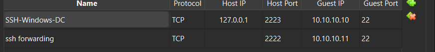

# Phase 0: Hypervisor & Virtual Network Setup

**Phase:** Phase 0 (Before You Start)  
**Host Platform:** Windows 11  
**Hypervisor:** Oracle VM VirtualBox 7.2 + Extension Pack  

---

## 1. Objective
Establish a dedicated, repeatable hypervisor environment capable of running multiple simultaneous guest virtual machines with inter-VM network connectivity and isolated outbound internet access.

---

## 2. Architecture & Virtual Network Design

To allow virtual machines to communicate with each other while also having internet access to download updates and packages, VirtualBox's **NAT Network** mode was chosen instead of standard NAT or Host-Only.

* **Network Type:** NAT Network (`LabNet`)
* **Subnet:** `10.10.10.0/24`
* **Default Virtual Gateway:** `10.10.10.1`
* **DHCP Service on NAT Network:** Enabled for initial PXE/bootstrapping, but servers are statically bound to prevent DHCP collisions once Windows Server DHCP is deployed.

---

## 3. Implementation Steps

### 3.1 Hypervisor Installation
1. Installed Oracle VM VirtualBox 7.2.
2. Installed the corresponding VirtualBox Extension Pack (`Oracle_VirtualBox_Extension_Pack-7.2.20.vbox-extpack`) to provide enhanced virtual hardware support and USB/network controllers.

### 3.2 Network Manager Configuration
Configured via `VirtualBox GUI -> File -> Tools -> Network Manager -> NAT Networks`:
* **Network Name:** `LabNet`
* **IPv4 Prefix:** `10.10.10.0/24`
* **Enable DHCP:** Selected (used as fallback)
* **IPv6 Support:** Disabled (simplified IPv4 lab routing)

### 3.3 NAT Network Port Forwarding (Host-to-Guest Administration)
By default, a VirtualBox NAT Network isolates guest VMs from direct inbound traffic initiated by the physical host. To enable seamless headless administration over SSH without adding secondary Host-Only adapters, port forwarding rules were defined directly on `LabNet`:



| Rule Name | Protocol | Host IP | Host Port | Guest IP | Guest Port | Target Role |
| :--- | :--- | :--- | :--- | :--- | :--- | :--- |
| **SSH-Windows-DC** | TCP | `127.0.0.1` | `2223` | `10.10.10.10` | `22` | Windows Server 2022 Core (`DC01`) |
| **ssh forwarding** | TCP | `*` (All) | `2222` | `10.10.10.11` | `22` | Ubuntu Server (`lab-linux-01`) |

#### Remote Access Syntax from Host Terminal:
```bash
# Connect to Linux Server
ssh -p 2222 <username>@127.0.0.1

# Connect to Windows Server Core Domain Controller
ssh -p 2223 Administrator@127.0.0.1
```

### 3.4 Media Staging
Retrieved official evaluation and LTS installation media:
* `windows-server-2022-evaluation.iso` (Microsoft Evaluation Center, 180-day eval)
* `ubuntu-26.04-live-server-amd64.iso` (Ubuntu Server LTS)

---

## 4. Verification Checkpoint

- [x] VirtualBox hypervisor initialized and operational.
- [x] Extension Pack active in preferences.
- [x] `LabNet` defined on `10.10.10.0/24`.
- [x] Installation media verified for integrity.
