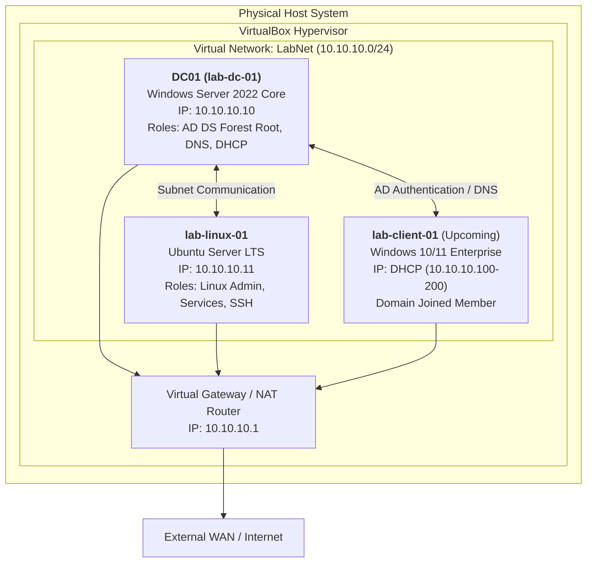

# Enterprise Systems Administration Lab Journal

[-blue?style=flat-square)](#roadmap--progress-tracker)
[](#lab-architecture--infrastructure-topology)
[](#infrastructure-inventory)

An enterprise-grade, multi-node lab environment built from bare-metal ISOs to simulate corporate infrastructure administration, identity management, network segmentation, and automation. This journal tracks architectural decisions, configuration files, CLI execution logs, verification steps, and incident response.

---

## Lab Architecture & Infrastructure Topology

The lab operates on an isolated, software-defined network (`LabNet`) simulating an internal enterprise subnet (`10.10.10.0/24`) with dual-stack administration (Windows Server Core and Linux Server).



---

## Infrastructure Inventory

| Node Name | Operating System | Hostname | Assigned IP | Gateway | DNS | Assigned Specs | Primary Role |
| :--- | :--- | :--- | :--- | :--- | :--- | :--- | :--- |
| **Domain Controller** | Windows Server 2022 Standard (Server Core) | `DC01` | `10.10.10.10/24` | `10.10.10.1` | `127.0.0.1` | 4 GB RAM, 2 vCPU, 40 GB dynamic disk | Root DC for `lab.local`, DNS Server, DHCP Server |
| **Linux Server** | Ubuntu Server LTS | `lab-linux-01` | `10.10.10.11/24` | `10.10.10.1` | `8.8.8.8` | 2 GB RAM, 2 vCPU, 25 GB dynamic disk | Linux administration, OpenSSH, web & storage services |
| **Workstation Client** | Windows Server 2022 Standard (Server Core) | `lab-client-01` | `10.10.10.11/24` (SSH Port 2224) | `10.10.10.1` | `10.10.10.10` | 2 GB RAM, 2 vCPU, 30 GB dynamic disk | Domain-joined member for GPO and user simulation |

---

## Roadmap & Progress Tracker

- [x] **[Phase 0: Environment & Hypervisor Setup](./00-lab-setup/README.md)**
  - [x] VirtualBox hypervisor & extension pack deployment
  - [x] Isolated NAT Network (`LabNet`: `10.10.10.0/24`) configuration
- [x] **[Phase 1: Linux Server & Network Foundations](./01-foundations-linux/README.md)**
  - [x] Minimal Ubuntu Server headless deployment
  - [x] Static IP assignment via Netplan (`10.10.10.11/24`)
  - [x] OpenSSH daemon configuration and host-to-guest verification
- [x] **[Phase 2: Windows Server Core & Active Directory](./02-active-directory/README.md)**
  - [x] Windows Server 2022 Server Core deployment (`lab-dc-01`)
  - [x] Post-install configuration via `sconfig` (Rename to `DC01`, static IP `10.10.10.10/24`)
  - [x] Active Directory Domain Services (AD DS) installation & forest promotion (`lab.local`)
  - [x] DHCP Server role installation and scope deployment (`10.10.10.100–200`)
  - [x] Enterprise Organizational Unit (OU) design, security groups, and bulk users
  - [x] Group Policy Object (GPO) creation and link enforcement
  - [x] Windows client domain-join validation
  - [x] Helpdesk service request ticket simulation
- [ ] **Phase 3: Linux Systems Administration & Hardening**
  - [ ] Linux RBAC (users, groups, octal permissions, visudo)
  - [ ] Systemd service lifecycle management and journald log inspection
  - [ ] Cron automation, SSH key authentication hardening, Nginx & Samba setup
- [ ] **Phase 4: Advanced Networking & pfSense Firewall**
  - [ ] pfSense dual-interface deployment (WAN / LAN)
  - [ ] VLAN segmentation (VLAN 10: Servers, VLAN 20: Clients)
  - [ ] Statefull firewall rule implementation and port filtering
- [ ] **Phase 5: Systems Automation & Scripting**
  - [ ] PowerShell bulk Active Directory provisioning & lifecycle scripts
  - [ ] Bash automated backup and system rotation scripts
- [ ] **Phase 6: Monitoring, Auditing & Security**
  - [ ] Dockerized monitoring stack (Zabbix)
  - [ ] Endpoint auditing and incident simulation
- [ ] **[Incident & Troubleshooting Log](./incident-log/incident-log.md)**
  - Real-world diagnostic logs written in STAR format (Situation, Task, Action, Result).

---

## Technical Competencies Highlighted

* **Headless Cross-Platform Administration**: Managing Windows Server Core and Linux Server entirely over OpenSSH and PowerShell remoting from the physical host workstation, eliminating dependence on hypervisor GUI consoles.
* **Identity & Access Management (IAM)**: AD DS forest bootstrapping, NetBIOS naming, DSRM password lifecycle, and directory schema awareness.
* **Linux Infrastructure**: Configuration management using YAML-based Netplan, systemd daemon control, and secure remote administration over OpenSSH.
* **Network Engineering**: IPv4 addressing, subnet masks (`/24`), routing tables, gateway resolution, and local vs. recursive DNS lookups.

---

## Repository Structure

```text
sysadmin-lab-journal/
├── README.md
├── docs/
│   ├── network-topology.md
│   └── templates/
│       └── lab-entry-template.md
├── 00-lab-setup/
│   └── README.md
├── 01-foundations-linux/
│   ├── README.md
│   └── configs/
│       └── 50-cloud-init.yaml
├── 02-active-directory/
│   ├── README.md
│   ├── 01-server-core-initial-config.md
│   ├── 02-adds-forest-deployment.md
│   └── ... (future lab steps)
└── incident-log/
    └── incident-log.md
```

---

*Authored by OnyxTech — Documenting hands-on enterprise infrastructure engineering.*
